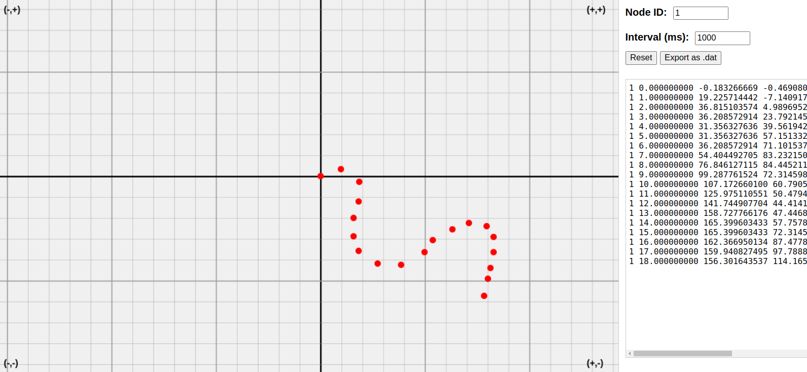

# Cooja Positioner (GUI in the browser)

🎯 A lightweight browser-based GUI tool for creating and managing mobile node positions for Contiki/Cooja simulations.

 <!-- buraya ekran görüntüsü ekleyebilirsin -->

## 🚀 Features

- Zoomable and pannable 2D grid (Cooja-like)
- Centered coordinate system with quadrant labels
- Interactive node placement with click
- Drag & drop nodes to update position
- Node ID and interval (ms) input fields
- Generates `.dat` file in Cooja-compatible format
- Save and reset options

## 📂 Output Format (`positions.dat`)

<node_id> <timestamp> <x> <y> 0.000000000 0.000000000

Example:

1 0.000000000 0.000000000 0.000000000 0.000000000 0.000000000 1 1.000000000 10.000000000 0.000000000 0.000000000 0.000000000

## 🧰 Usage

1. Open `index.html` in a modern browser (Chrome recommended)
2. Adjust `Node ID` and `Interval (ms)` as needed
3. Click to place a node
4. Drag any node to reposition it
5. Click **Save** to download your `positions.dat` file

## 💡 Notes

- The `.dat` file is reset when clicking **Reset**
- File overwriting is not allowed in browsers; manually replace previous file if needed

## 📷 Demo Video

[📺 Watch on YouTube](https://your-link-here)

---

## 📜 License

MIT License

## 📌 Citation

If you use this project in academic work or tools, please cite it as:

**Your Name (2024)**, “Cooja Positioner GUI”, GitHub repository:  
https://github.com/yourname/cooja-positioner
